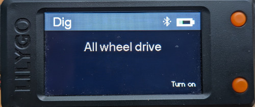

# RC Crawler controller display

A monitoring display and control interface for sensors and devices installed in RC crawler car. Hardware used
is [LilyGo T-Display-S3](https://docs.platformio.org/en/latest/boards/espressif32/lilygo-t-display-s3.html).

This display is connected by bluetooth to the Arduino inside the car.

See the [Controller](https://github.com/samo1/rc-inclinometer-unit) description for more information.

## Winch

## Inclinometer

## Speed meter

## Front dig function

## Installation on the controller

Power is provided by the AA batteries in the controller. A new power wire is soldered directly on to the battery tray.
As normal AA batteries last only very short time, Li-Po batteries are used, which can last for several hours. 

## See it in action

[Youtube video](https://youtu.be/zrnESGQyN5k)
